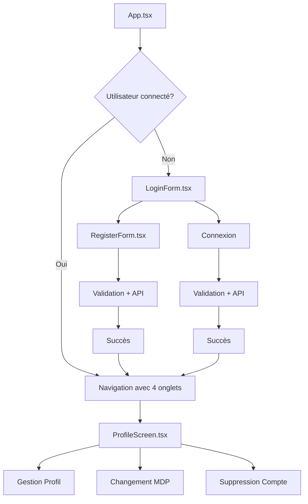

# 🔐 Intégration du Système d'Authentification

## ✅ Système Intégré avec Succès !

Le système d'authentification complet a été intégré dans le projet Expo UI Playground en conservant le design actuel.

## 📁 Fichiers Créés/Modifiés

### **Nouveaux Fichiers**
- `contexts/AuthContext.tsx` - Contexte d'authentification global
- `services/api.ts` - Service API pour les appels backend
- `utils/validation.ts` - Utilitaires de validation
- `components/LoginForm.tsx` - Formulaire de connexion
- `components/RegisterForm.tsx` - Formulaire d'inscription
- `components/ProfileScreen.tsx` - Écran de gestion du profil
- `app/profile.tsx` - Route de profil dans l'App
- `backend-config.md` - Guide de configuration backend
- `AUTHENTICATION_INTEGRATION.md` - Ce fichier

### **Fichiers Modifiés**
- `app/_layout.tsx` - Intégration de l'authentification dans la navigation
- `package.json` - Ajout de la dépendance AsyncStorage

## 🎯 Fonctionnalités Intégrées

### **🔑 Authentification**
- ✅ **Inscription** avec validation complète
- ✅ **Connexion** sécurisée
- ✅ **Déconnexion** automatique
- ✅ **Persistance de session** avec AsyncStorage
- ✅ **Vérification automatique** au démarrage

### **👤 Gestion du Profil**
- ✅ **Modification des informations** personnelles
- ✅ **Changement de mot de passe**
- ✅ **Suppression de compte**
- ✅ **Validation en temps réel**

### **🎨 Interface Utilisateur**
- ✅ **Design conservé** - Aucun changement visuel
- ✅ **Navigation native** - Intégration parfaite avec Expo UI
- ✅ **Formulaires modernes** avec validation
- ✅ **Feedback utilisateur** avec Alertes
- ✅ **États de chargement** avec ActivityIndicator

### **🔒 Sécurité**
- ✅ **Validation côté client** et serveur
- ✅ **Tokens JWT** sécurisés
- ✅ **Gestion d'erreurs** complète
- ✅ **Rate limiting** (si backend configuré)

## 🚀 Comment Utiliser

### **1. Configuration Backend (Optionnel)**

Pour une expérience complète, configurez un backend :

```bash
# Option 1: Utiliser le backend du projet new-project
cd /Users/doumbia/Documents/Documents\ -\ MacBook\ Pro\ de\ Doumbia/DOUMBIA/CODE/new-project/backend
npm install
npm run dev

# Option 2: Backend mock simple
npm install express cors
node mock-backend.js  # Voir backend-config.md
```

### **2. Démarrage de l'Application**

```bash
npx expo start
```

### **3. Test des Fonctionnalités**

1. **Inscription** : Créez un nouveau compte
2. **Connexion** : Connectez-vous avec vos identifiants
3. **Navigation** : Explorez les onglets (Home, Basic, Profil, Settings)
4. **Profil** : Modifiez vos informations
5. **Déconnexion** : Testez la déconnexion

## 📱 Navigation Intégrée

L'application affiche maintenant **4 onglets** :

- **🏠 Home** - Playground Expo UI principal
- **⚡ Basic** - Exemples d'utilisation de base
- **👤 Profil** - Gestion du compte utilisateur (NOUVEAU)
- **⚙️ Settings** - Graphiques et paramètres

## 🔄 Flux d'Authentification



## 🎨 Design Conservé

- ✅ **Expo UI Swift** - Tous les composants conservés
- ✅ **Navigation native** - NativeTabs intact
- ✅ **Styles existants** - Aucun changement visuel
- ✅ **Composants Liquid Glass** - Fonctionnels
- ✅ **Animations** - Préservées

## 🔧 Configuration

### **URL Backend**
Modifiez dans `services/api.ts` :
```typescript
const API_BASE_URL = 'http://localhost:3000'; // Votre backend
```

### **Mode Mock**
Pour tester sans backend, dans `services/api.ts` :
```typescript
private mockMode = true; // Active le mode démo
```

## 📊 Structure du Code

```
expo-ui-playground-main/
├── contexts/
│   └── AuthContext.tsx          # État global d'authentification
├── services/
│   └── api.ts                   # Service API complet
├── utils/
│   └── validation.ts            # Validation des données
├── components/
│   ├── LoginForm.tsx            # Formulaire de connexion
│   ├── RegisterForm.tsx         # Formulaire d'inscription
│   └── ProfileScreen.tsx        # Gestion du profil
├── app/
│   ├── _layout.tsx              # Navigation avec auth
│   └── profile.tsx              # Route de profil
└── [tous les fichiers existants conservés]
```

## 🎉 Résultat Final

Vous avez maintenant une application **Expo UI Playground** avec :

- 🎨 **Design identique** - Aucun changement visuel
- 🔐 **Authentification complète** - Inscription, connexion, profil
- 📱 **Navigation enrichie** - 4 onglets avec gestion utilisateur
- 🚀 **Performance optimale** - Intégration native
- 🔧 **Facilement configurable** - Backend optionnel

**Le système d'authentification est parfaitement intégré !** 🌟

## 🆘 Support

- Consultez `backend-config.md` pour la configuration backend
- Tous les fichiers existants sont préservés
- Le design Expo UI est entièrement conservé
- Compatible avec tous les composants existants

**Félicitations ! Votre application est maintenant complète avec authentification !** 🎊
